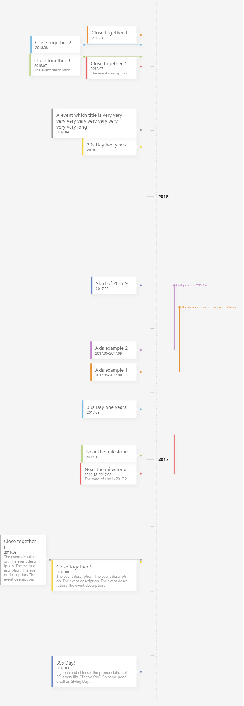

# Rules Timeline

Given a event data, drawn a beautiful timeline on canvas. Powered by short-night engine.

Try it online:

- http://short-night.pea3nut.org/example/rule-example-1



```ts
const events = [{
    date: '2017-5',
    title: 'Axis example 1',
    endDate: '2017-8',
    endText: 'The axis can avoid for each others',
}, {
    date: '2017-6',
    title: 'Axis example 2',
    endDate: '2017-9-1',
    endText: 'End point is 2017.9',
}, {
    date: '2017-9-1',
    title: 'Start of 2017.9',
}, {
    date: '2017-1-2',
    title: 'Near the milestone',
}, {
    date: '2016-12-15',
    endDate: '2017-2',
    title: 'Near the milestone',
    description: 'The date of end is 2017.2.',
}, {
    date: '2018-8-15',
    title: 'Close together 1',
}, {
    date: '2018-8-1',
    title: 'Close together 2',
}, {
    date: '2018-7-15',
    title: 'Close together 3',
    description: 'The event description.',
}, {
    date: '2018-7-1',
    title: 'Close together 4',
    description: 'The event description.',
}, {
    date: '2016-8-12',
    title: 'Close together 5',
    description: 'The event description. The event description. The event description.' +
        ' The event description. The event description.',
}, {
    date: '2016-8-15',
    title: 'Close together 6',
    description: 'The event description. The event description. The event description. ' +
        'The event description. The event description.',
}, {
    date: '2018-4-2',
    title: 'A event which title is very very very very very very very very very very long',
}, {
    date: '2018-3-9',
    title: '39s Day two years!',
}, {
    date: '2017-3-9',
    title: '39s Day one years!',
}, {
    date: '2016-3-9',
    title: '39s Day!',
    description: 'In japan and chinese, the pronunciation  of 39 is very like "Thank You". ' +
        'So some people call as Giving Day.',
}];

Rules.draw('#app', events);
```

# Install

### In Webpack

Installing by npm:

```sh
npm install --save @foxzilla/rules
```

Using by ES6 modules:

```js
import * as Rules from '@foxzilla/rules';

Rules.draw(...);
new Rules.Timeline(...);
```

### In Browser:

Download and refer the `dist/rules.js` in your project.

```html
<!doctype html>
<html>
<head>
    <meta charset="UTF-8">
</head>
<body>
    <div id="app"></div>

    <script src="rules.js"></script>
    <script>
        Rules.draw(...);
        new Rules.Timeline(...);
    </script>
</body>
</html>
```

## APIs

### .draw(el, data)

```ts
async function draw(
    el :string | HTMLElement,
    data :Array<{
        date :string,
        title :string,
        
        // Optional
        description ?:string,
        endDate ?:string | 'now', // a string parse to a date
        endText ?:string,
    }>,
) :Promise<Timeline>
```

Draw a timeline using `data` on `el`.

Return a instance of [Timeline][#.Timeline] wrapped by Promise.

### .Timeline

The constructor of Timeline. You can draw a timeline manually.

```js
(async function has() {
    const timeline = new Rules.Timeline(
        Rules.Timeline.mount('#app', 'rules'),
        // ...other construct info, see: 
        // https://foxzilla.github.io/short-night/interfaces/_timeline_.constructinfo.html
    );
   
    timeline.drawInfo.events = [...]; // change properties of timeline

    await timeline.apply({...}); // apply the changes and set RuntimeInfo, see https://foxzilla.github.io/short-night/interfaces/_timeline_.runtimeinfo.html 

    timeline.draw(); // draw a timeline

}());
```

More info see the Short-Night engine doc(check out before switch from "All" to "Public" in nav bar):

- https://foxzilla.github.io/short-night/modules/_timeline_.html


### .Engine

The Short-Night engine. see: 

- https://foxzilla.github.io/short-night/globals.html
- https://github.com/FoXZilla/short-night/blob/master/src/index.ts

# Contributor's Guide

Pull requests are welcome. For major changes, please open an issue first to discuss what you would like to change.

Please make sure to update tests as appropriate.

1. Fork the project on GitHub.

2. Clone the project.

3. perform the below command
```sh
npm link
```
4. Create a branch specific to the issue you are working on.
```sh
git checkout -b branch-name
```
5. Add your modified files to Git,
```sh
git add path/to/filename.ext
```
You can also add all unstaged files using:
```sh
git add .
```
Note: using a git add . will automatically add all files. You can do a git status to see your changes, but do it before git add.

6. Commit your changes using a descriptive commit message.
```sh
git commit -m "Brief Description of Commit"
```
7. Push your commits to your GitHub Fork:
```sh
git push -u origin branch-name
```
8. Submit a pull request.

### Follow the below step in your local project

1. Installing the Rules
```sh
npm install @foxzilla/rules
```
2. Linking the Rules with your local connection
```sh
npm link @foxzilla/rules
```
